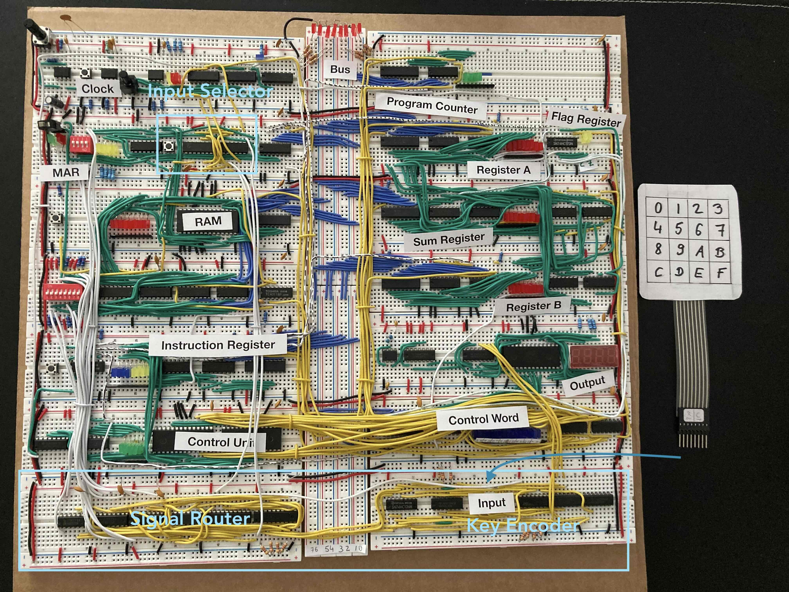

+++ work in progress +++

# Hex-Keyboard

This is a side project for Ben Eater's 8 bit computer. It adds an input module that enables using a simple hex keyboard for code input. It consists of three sub-modules:

## Input selector 
Selects the input type (address / msb / lsb) and consists of the following components:
- pushbutton
- double D flip flop [74]
- 2x 2-4 decoders (quad NAND) 
- 3 inverters (can be used from clock)
- 3 LEDs

## Key encoder
Converts the button presses of the hex keyboard into a 4 bit code and consists of the following components:
- hex keyboard (or simply 16 push buttons)
- counter from output module (needs to be inverted) 
- 2x 4-2 encoders (quad OR)
- 2 triggers - one for key encoder (4-OR gate), one for signal switch (4-OR gate + additional OR for 0) 
- 4 bit 3-state Buffer (with Schmitt trigger) [126]

## Signal router (address / msb / lsb):
Routes the input signal to MAR or RAM according to the input selected. It and consists of the following components: 
- 2x double 4 bit buffer (244)
- 3x quad buffers (175)
- 3x 3-state Buffer (125)

## Notes

The first module can be placed directly next to the MAR module, and if you keep the lowest two breadboards (right and left side) empty for Ben Eater's original design, you can fit the last two modules there (see image).

The project can easily be extended to 8 bit addresses: simply add another 175 and one more indicator LED for the 8 bit address.
